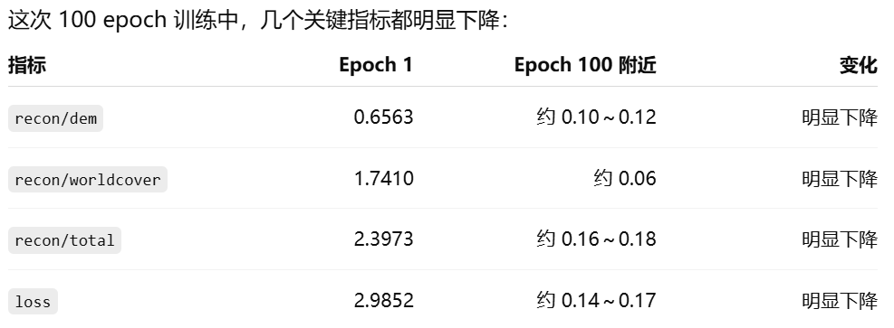

# 实验总结：v0.1 与 v0.2-a

## 1. 阶段目标

本项目按阶段推进雅江区域 AEF 风格多源遥感时空嵌入模型训练。

当前已完成两个阶段：

```text
v0.1   dummy 数据单卡冒烟测试
v0.2-a 小规模真实数据单卡联调
````

---

## 2. v0.1：Dummy 数据单卡冒烟测试

### 2.1 目标

v0.1 主要验证训练工程链路是否能跑通，不验证模型效果。

检查内容包括：

* 配置读取
* dummy dataset 构造 batch
* dataloader 迭代
* model forward
* loss 计算
* backward
* optimizer step
* epoch 训练循环

### 2.2 数据设置

使用 `DummyYajiangDataset` 构造随机数据。

输入源：

```text
s2
s1
hls
```

目标源：

```text
dem
worldcover
jrc_water
```

### 2.3 运行结果

v0.1 最终可以稳定跑完 10 个 epoch，loss 正常计算并下降，说明训练主链路已经打通。

### 2.4 结论

v0.1 已完成。

该阶段证明：

* 代码结构基本可运行
* 模型 forward / backward 正常
* loss 与 optimizer 能正常工作
* 可以进入真实数据联调阶段

---

## 3. v0.2-a：小规模真实数据单卡联调

### 3.1 目标

v0.2-a 目标是从 dummy data 切换到真实雅江数据，验证真实数据训练链路是否可行。

重点验证：

* 真实数据是否按 patch 对齐
* `.tif` 是否能转换成 `.npy`
* WorldCover 类别是否能正确重映射
* DEM 是否需要归一化
* manifest 是否能正确组织样本
* 小批量真实数据训练 loss 是否下降

---

## 4. 使用数据

原始数据目录：

```text
/workspace/raw/yajiang/
```

当前 v0.2-a 使用：

### 输入源

```text
s2
s1
```

### 监督目标

```text
dem
worldcover
```

暂不使用：

```text
jrc_water
landsat
modis_ndvi
modis_lst
dynamic_world
```

原因是 v0.2-a 只关注最小真实训练闭环。

---

## 5. 数据检查结果

### Sentinel-2

```text
bands: 6
size: 128 × 128
dtype: float64
```

### Sentinel-1

```text
bands: 2
size: 128 × 128
dtype: float64
```

### DEM

```text
bands: 1
size: 43 × 43
dtype: float32
```

### WorldCover

```text
bands: 1
size: 128 × 128
dtype: uint8
```

结论：

* `s2/s1` 通道数与配置匹配；
* `dem` 适合作为连续值 target；
* `worldcover` 适合作为分类 target；
* `jrc_water` 暂不接入，因为存在 `-128` nodata 和非连续类别编码。

---

## 6. 数据预处理

### 6.1 数据目录

从原始数据中拷贝 8 个 patch：

```text
patch_000000 ~ patch_000007
```

转换后目录：

```text
/workspace/hyh/yajiang-aef/data/debug_small_npy/
  patch_000000/
    inputs/
      s2/
      s1/
    targets/
      dem.npy
      worldcover.npy
```

### 6.2 WorldCover 重映射

原始类别值：

```text
10, 30, 40, 50, 60, 70, 80, 100
```

重映射为：

```text
10  -> 0
30  -> 1
40  -> 2
50  -> 3
60  -> 4
70  -> 5
80  -> 6
100 -> 7
```

因此配置中：

```yaml
worldcover:
  out_channels: 8
```

### 6.3 DEM 标准化

第一次训练时 DEM 未归一化，`recon/dem` 约为 1208，loss 量级异常偏大。

统计 8 个 patch 后得到：

```text
DEM mean: 2677.106
DEM std: 413.22937
```

因此采用：

```python
dem = (dem - 2677.106) / 413.22937
```

标准化后 DEM loss 恢复到合理量级。

---

## 7. 配置与运行

配置文件：

```text
configs/yajiang_v0_2_a.yaml
```

运行脚本：

```text
scripts/run_v0_2_a.sh
```

运行命令：

```bash
cd /workspace/hyh/yajiang-aef
bash scripts/run_v0_2_a.sh
```

---

## 8. 实验结果

### 8.1 DEM 未归一化时

```text
recon/dem:        1208.5491 -> 1207.8343
recon/worldcover: 2.3641    -> 0.3165
loss:             1411.8691 -> 1220.6562
```

结论：

* WorldCover 可以正常学习；
* DEM loss 量级过大，基本不下降；
* 需要对 DEM 做归一化。

---

### 8.2 DEM 标准化后

训练 10 个 epoch 后：

```text
recon/dem:        0.6563 -> 0.4025
recon/worldcover: 1.7410 -> 0.3038
recon/total:      2.3973 -> 0.7063
loss:             2.9852 -> 0.8214
```

结论：

* DEM 标准化有效；
* DEM 和 WorldCover 两个 target 都能学习；
* 小规模真实数据训练链路正常。

---

## 9. Checkpoint 保存

已在 `Trainer` 中加入 checkpoint 保存。

保存目录：

```text
/workspace/hyh/yajiang-aef/outputs/aef_hyh_yajiang_v0_2_a/checkpoints/
```

每个 epoch 保存：

```text
epoch_001.pt
epoch_002.pt
...
latest.pt
```

说明 checkpoint 功能已经验证通过。

---

## 10. 当前结论

### v0.1

已完成。

证明：

* dummy data 训练链路跑通；
* 模型 forward / backward / optimizer step 正常；
* 可以进入真实数据阶段。

### v0.2-a

已基本完成。

证明：

* 小规模真实数据可读取；
* `.tif -> .npy` 转换有效；
* WorldCover 重映射有效；
* DEM 标准化有效；
* manifest 真实训练链路跑通；
* checkpoint 保存正常；
* 模型可以在小批量真实数据上学习。

---

## 11. 当前注意事项

* 当前只使用 8 个 patch，不能说明泛化能力；
* DEM mean/std 当前来自 debug small，后续完整训练需重新统计；
* JRC Water 尚未接入，后续需要处理 nodata 和类别重映射；
* 正则项仍需在后续阶段继续调参。

---

## 12. 下一步计划

### v0.2-a-plus

延长训练到 50 或 100 epoch，进一步验证小样本过拟合能力。



### v0.2-b

扩大真实小数据规模：

```text
32 或 64 个 patch
```

验证更大 debug 数据下训练稳定性。

### v0.2-c

接入 `jrc_water`，处理：

* `-128` nodata
* 类别重映射
* mask loss

v0.2-c 当前结论:

本阶段成功完成 jrc_water target 的工程接入，包括 GeoTIFF 读取、类别重映射、nodata 转 ignore_index=255、manifest 注册、categorical loss ignore_index 处理以及三目标训练流程验证。

但是，对当前 8 个 debug patch 统计发现，jrc_water 有效像素仅 2 / 14792，占比约 0.0135%。因此当前 `recon/jrc_water` 快速下降不代表模型有效学习水体监督，而主要是由于有效监督像素极少。当前 v0.2-c 只能证明 jrc_water 代码链路可用，不能证明 jrc_water 数据监督有效。

下一步需要筛选包含更多有效 JRC Water 像素的 patch，重新构建 debug_jrc 数据集后再做 jrc_water 训练验证。

### v0.3

进入完整数据单卡 baseline 训练，重新统计完整训练集归一化参数，并固化配置与 checkpoint。
