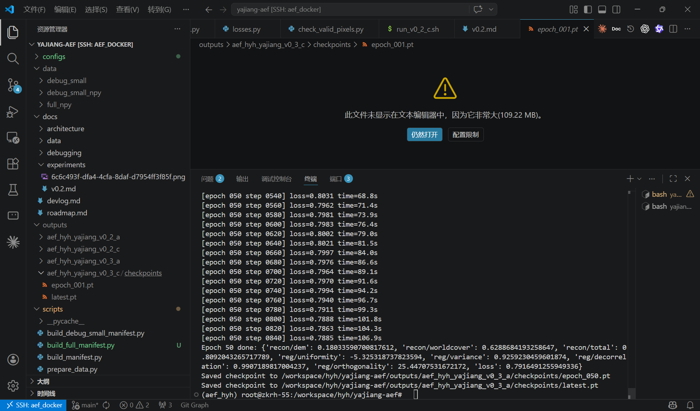

# 实验总结：v0.3-a 全量数据单卡 baseline

## 1. 阶段目标

v0.3-a 的目标是从 v0.2 的 8 个 debug patch，推进到雅江全量 patch 的单卡 baseline 训练。

本阶段重点验证：

* 全量 GeoTIFF 能否稳定转换为 `.npy`；
* 全量 DEM 归一化统计是否能重新计算并固化；
* 全量 WorldCover 类别是否完整覆盖并正确重映射；
* full manifest 是否能组织 1708 个样本；
* 单卡训练是否能完整跑完 50 epoch；
* checkpoint 保存是否在全量训练下正常工作。



---

## 2. 相比 v0.2 的主要变化

v0.2-a / v0.2-c 使用的是：

```text
/workspace/hyh/yajiang-aef/data/debug_small_npy/train.jsonl
8 records
```

v0.3-a 切换为：

```text
/workspace/hyh/yajiang-aef/data/full_npy/train.jsonl
1708 records
```

核心变化如下：

* 数据规模从 8 个 patch 扩大到 1708 个 patch；
* DEM mean/std 从 debug small 统计切换为全量统计；
* WorldCover 在全量数据中发现新增原始类别 `20`，因此 `out_channels` 从 8 改为 9；
* 训练 epoch 设置为 50；
* 仍保持 v0.2-a 的最小监督组合：`dem + worldcover`，本阶段不接入 `jrc_water`。

---

## 3. 数据预处理

预处理脚本：

```text
scripts/prepare_full_npy.py
```

输入原始数据：

```text
/workspace/raw/yajiang/
```

输出目录：

```text
/workspace/hyh/yajiang-aef/data/full_npy/
```

使用输入源：

```text
s2
s1
```

使用监督目标：

```text
dem
worldcover
```

每个 patch 的目标结构：

```text
patch_xxxxxx/
  inputs/
    s2/
    s1/
  targets/
    dem.npy
    worldcover.npy
```

---

## 4. 全量 DEM 统计

v0.2-a 使用 debug small 统计：

```text
DEM mean: 2677.106
DEM std:  413.22937
```

v0.3-a 对 1708 个 full patch 重新统计：

```text
DEM mean: 2999.8609070042376
DEM std:  1026.7242051987812
```

归一化方式：

```python
dem = (dem - 2999.8609070042376) / 1026.7242051987812
```

统计结果已写入：

```text
data/full_npy/preprocess_meta.json
```

---

## 5. WorldCover 类别重映射

v0.2 debug small 覆盖到的 WorldCover 原始类别为：

```text
10, 30, 40, 50, 60, 70, 80, 100
```

v0.3-a 全量数据额外出现：

```text
20
```

因此 v0.3-a 的映射为：

```text
10  -> 0
30  -> 1
40  -> 2
50  -> 3
60  -> 4
70  -> 5
80  -> 6
100 -> 7
20  -> 8
```

配置中对应：

```yaml
worldcover:
  loss_type: categorical
  out_channels: 9
```

当前脚本使用 strict 模式，遇到未映射 WorldCover 类别会直接报错，避免静默生成错误标签。

---

## 6. Manifest 构建

manifest 构建脚本：

```text
scripts/build_full_manifest.py
```

输出：

```text
data/full_npy/train.jsonl
```

样本数：

```text
1708 records
```

每个样本包含：

* `s2`: 2023Q1 到 2026Q1 的季度帧；
* `s1`: 2023Q1 到 2026Q1 的季度帧；
* `dem`: 静态连续值 target；
* `worldcover`: 静态分类 target；
* `valid_start_ms`: `1672531200000`；
* `valid_end_ms`: `1767225600000`；
* `target_relative_time`: `0.5`；
* `metadata`: `[0.0, 0.0, 0.0, 0.0]`。

---

## 7. 配置与运行

配置文件：

```text
configs/yajiang_v0_3_a.yaml
```

运行脚本：

```text
scripts/run_v0_3_a.sh
```

运行命令：

```bash
cd /workspace/hyh/yajiang-aef
bash scripts/run_v0_3_a.sh
```

运行脚本默认设置：

```text
GPU_ID=6
DEVICE=cuda
SPLIT=train
```

主要训练配置：

```yaml
batch_size: 2
num_workers: 4
image_size: 128
max_frames: 16
epochs: 50
lr: 0.0001
weight_decay: 0.01
grad_clip_norm: 1.0
```

模型结构参数保持 v0.2 系列设置：

```yaml
stem_dim: 128
precision_dim: 256
embedding_dim: 128
num_blocks: 4
num_heads: 4
vmf_kappa: 2000.0
skip_l2_training: true
gradient_checkpointing: false
```

---

## 8. 训练结果

v0.3-a 已完成 50 个 epoch 的单卡训练。

从 checkpoint 读取到：

```text
epoch: 50
global_step: 42700
```

计算关系：

```text
1708 samples / batch_size 2 = 854 steps per epoch
854 steps * 50 epochs = 42700 global steps
```

checkpoint 保存目录：

```text
outputs/aef_hyh_yajiang_v0_3_a/checkpoints/
```

已生成：

```text
epoch_001.pt
epoch_002.pt
...
epoch_050.pt
latest.pt
```

保存时间显示训练大致从 2026-04-27 23:46 持续到 2026-04-28 01:15。

---

## 9. 当前结论

v0.3-a 已完成。

本阶段证明：

* 全量 1708 个 patch 的 `.tif -> .npy` 转换链路可用；
* 全量 DEM mean/std 已重新统计并固化；
* 全量 WorldCover 发现并接入了新增类别 `20`；
* full manifest 可正常驱动训练；
* 以 `s2 + s1 -> dem + worldcover` 为目标的全量单卡 baseline 可以跑完 50 epoch；
* checkpoint 保存机制在全量训练下正常。

---

## 10. 当前注意事项

* 本轮训练没有把 stdout 持久化到日志文件，checkpoint 中也未保存每个 epoch 的 loss 指标，因此当前只能确认训练完整结束，不能从文件中复盘 loss 曲线；
* `jrc_water` 在 v0.2-c 中只验证了工程链路，本轮 v0.3-a 没有接入；
* 当前 full manifest 只有 train split，还没有 train/val/test 切分；
* target metadata 仍使用 `[0.0, 0.0, 0.0, 0.0]` 占位；
* `valid_end_ms` 和 2026Q1 帧 timestamp 相同，后续如做严格时间窗口采样，需要确认边界语义是否符合预期。

---

## 11. 下一步建议

### v0.3-a-log

重新跑或继续跑时将训练输出落盘：

```bash
bash scripts/run_v0_3_a.sh 2>&1 | tee outputs/aef_hyh_yajiang_v0_3_a/train.log
```

并考虑在 `Trainer.save_checkpoint` 中保存 `train_metrics`，便于后续直接从 checkpoint 汇总 loss 曲线。

### v0.3-b

增加 train/val split，至少记录：

* train loss；
* val loss；
* `recon/dem`；
* `recon/worldcover`；
* 正则项 loss。

### v0.3-c

在全量或筛选后的有效水体 patch 上重新接入 `jrc_water`，避免 v0.2-c 中有效监督像素过少的问题。
